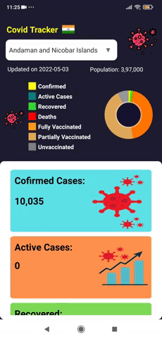
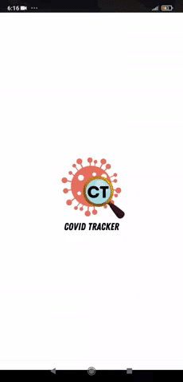

<!---->

# COVID Tracker App

**COVID Tracker app** is an android application which helps the users to get insights into the impact of COVID-19 on all the states and union territories of **India**. This application will provide information such as:
-Number of **confirmed** cases
-Number of **active** cases
-Number of **deaths**
-Number of people **recovered** from COVID-19
-Number of **COVID-19 tests** performed
-The number of people who are **vaccinated** with a single dose and two doses.
-Total **population** of the selected state or union territory.

The user interface of the application is user-friendly and easy to understand.

 

Users can get the above information about each state and union territory by selecting their desired state or union territory from the provided dropdown.

 

If a user opens this application in the absence of internet then user will be greeted with an alert box.

 

This application provides the information to the users with the help of REST API. Due to this, users can access the information anytime and anywhere in the presence of an active internet connection.

## Features

- With the help of an active internet connection users can access the information anywhere and anytime instantly.
- The information is updated on a daily basis.
- The provided pie chart helps the user to assess the impact of COVID-19.
-This application supports screen sizes from 4.7 inches to current available sizes.

## Libraries used
- [MPAndroidChart](https://github.com/PhilJay/MPAndroidChart#documentation) by Phillip Jahoda
- [Volley](https://google.github.io/volley/) by Google
- [Lottie](https://github.com/airbnb/lottie-android) for Android
## REST API Details
We have used the REST API provided by [covid19tracker.in](https://covid19tracker.in/) an initiative by IIT Hyderabad.
## Programing Language

## References
1. [How to Make a Covid-19 Tracker Android App?](https://www.youtube.com/watch?v=opCW91zYJcI) - by GeeksForGeeks.
2. [covid Tracker App android studio - Using REST API & Retrofit in Android Studio java](https://www.youtube.com/watch?v=SPdFM1YmxrA&list=PL6Rs84MkNq7mJaoYohqOsvJcDpZqJrWe1) - by Papaya Coders.
3. [Android Fundamentals for Beginners](https://www.youtube.com/channel/UCKNTZMRHPLXfqlbdOI7mCkg) - by Philipp Lackner.
